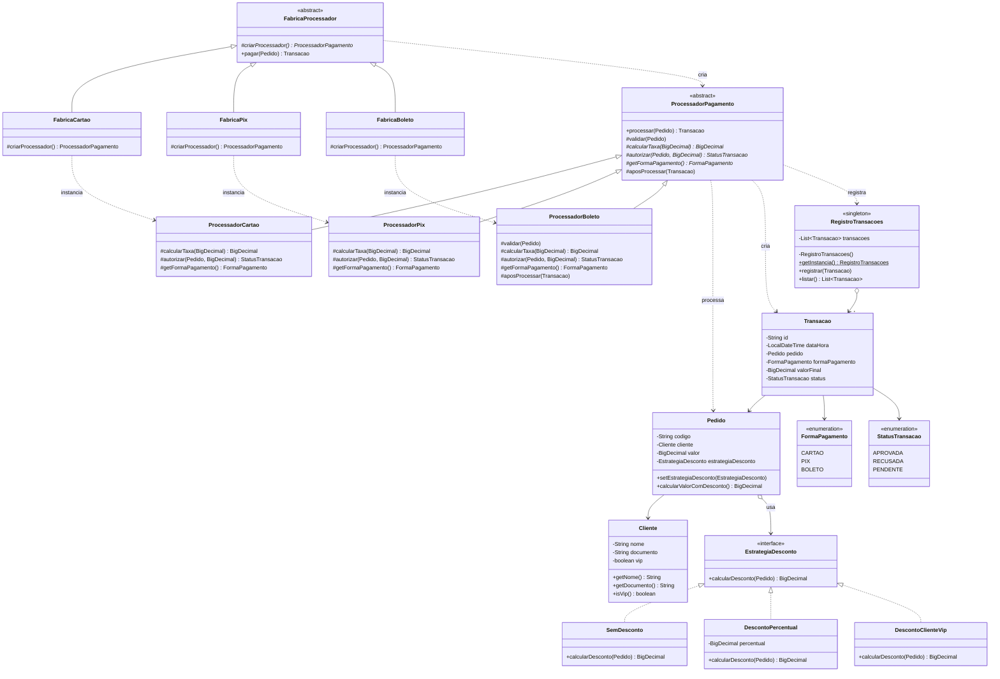

# Diagrama de Classes

```mermaid
classDiagram
    direction TB

    %% ===== Domínio =====
    class Cliente {
        -String nome
        -String documento
        -boolean vip
        +getNome() String
        +getDocumento() String
        +isVip() boolean
    }

    class Pedido {
        -String codigo
        -Cliente cliente
        -BigDecimal valor
        -EstrategiaDesconto estrategiaDesconto
        +setEstrategiaDesconto(EstrategiaDesconto)
        +calcularValorComDesconto() BigDecimal
    }

    class Transacao {
        -String id
        -LocalDateTime dataHora
        -Pedido pedido
        -FormaPagamento formaPagamento
        -BigDecimal valorFinal
        -StatusTransacao status
    }

    class FormaPagamento {
        <<enumeration>>
        CARTAO
        PIX
        BOLETO
    }

    class StatusTransacao {
        <<enumeration>>
        APROVADA
        RECUSADA
        PENDENTE
    }

    %% ===== Strategy =====
    class EstrategiaDesconto {
        <<interface>>
        +calcularDesconto(Pedido) BigDecimal
    }
    class SemDesconto {
        +calcularDesconto(Pedido) BigDecimal
    }
    class DescontoPercentual {
        -BigDecimal percentual
        +calcularDesconto(Pedido) BigDecimal
    }
    class DescontoClienteVip {
        +calcularDesconto(Pedido) BigDecimal
    }

    %% ===== Template Method =====
    class ProcessadorPagamento {
        <<abstract>>
        +processar(Pedido) Transacao
        #validar(Pedido)
        #calcularTaxa(BigDecimal)* BigDecimal
        #autorizar(Pedido, BigDecimal)* StatusTransacao
        #getFormaPagamento()* FormaPagamento
        #aposProcessar(Transacao)
    }
    class ProcessadorCartao {
        #calcularTaxa(BigDecimal) BigDecimal
        #autorizar(Pedido, BigDecimal) StatusTransacao
        #getFormaPagamento() FormaPagamento
    }
    class ProcessadorPix {
        #calcularTaxa(BigDecimal) BigDecimal
        #autorizar(Pedido, BigDecimal) StatusTransacao
        #getFormaPagamento() FormaPagamento
    }
    class ProcessadorBoleto {
        #validar(Pedido)
        #calcularTaxa(BigDecimal) BigDecimal
        #autorizar(Pedido, BigDecimal) StatusTransacao
        #getFormaPagamento() FormaPagamento
        #aposProcessar(Transacao)
    }

    %% ===== Factory Method =====
    class FabricaProcessador {
        <<abstract>>
        #criarProcessador()* ProcessadorPagamento
        +pagar(Pedido) Transacao
    }
    class FabricaCartao {
        #criarProcessador() ProcessadorPagamento
    }
    class FabricaPix {
        #criarProcessador() ProcessadorPagamento
    }
    class FabricaBoleto {
        #criarProcessador() ProcessadorPagamento
    }

    %% ===== Singleton =====
    class RegistroTransacoes {
        <<singleton>>
        -List~Transacao~ transacoes
        -RegistroTransacoes()
        +getInstancia()$ RegistroTransacoes
        +registrar(Transacao)
        +listar() List~Transacao~
    }

    %% ===== Relações =====
    Pedido --> Cliente
    Pedido o--> EstrategiaDesconto : usa
    EstrategiaDesconto <|.. SemDesconto
    EstrategiaDesconto <|.. DescontoPercentual
    EstrategiaDesconto <|.. DescontoClienteVip

    ProcessadorPagamento <|-- ProcessadorCartao
    ProcessadorPagamento <|-- ProcessadorPix
    ProcessadorPagamento <|-- ProcessadorBoleto
    ProcessadorPagamento ..> Pedido : processa
    ProcessadorPagamento ..> Transacao : cria
    ProcessadorPagamento ..> RegistroTransacoes : registra

    FabricaProcessador <|-- FabricaCartao
    FabricaProcessador <|-- FabricaPix
    FabricaProcessador <|-- FabricaBoleto
    FabricaProcessador ..> ProcessadorPagamento : cria
    FabricaCartao ..> ProcessadorCartao : instancia
    FabricaPix ..> ProcessadorPix : instancia
    FabricaBoleto ..> ProcessadorBoleto : instancia

    Transacao --> Pedido
    Transacao --> FormaPagamento
    Transacao --> StatusTransacao
    RegistroTransacoes o--> "*" Transacao
```
